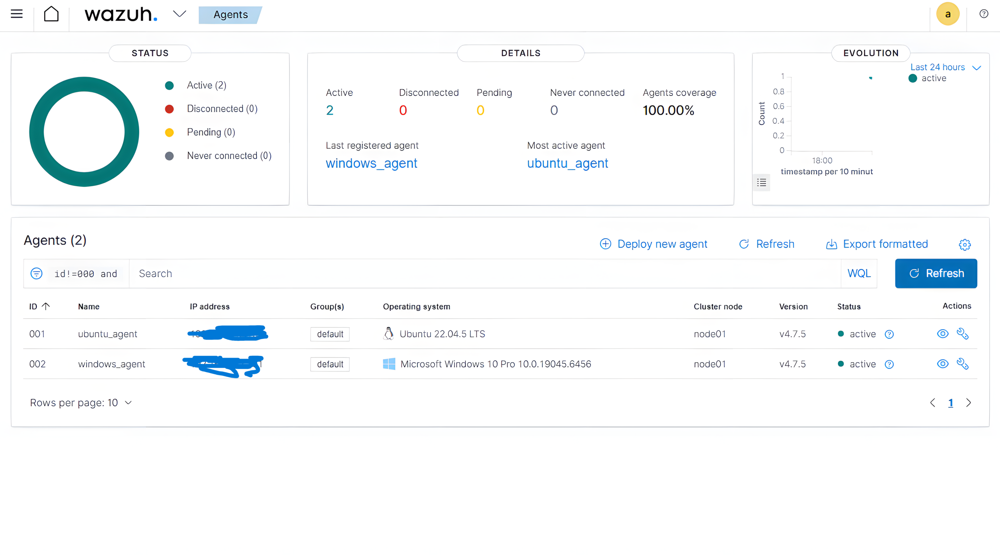
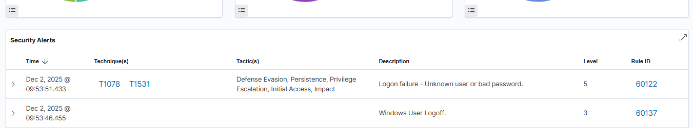
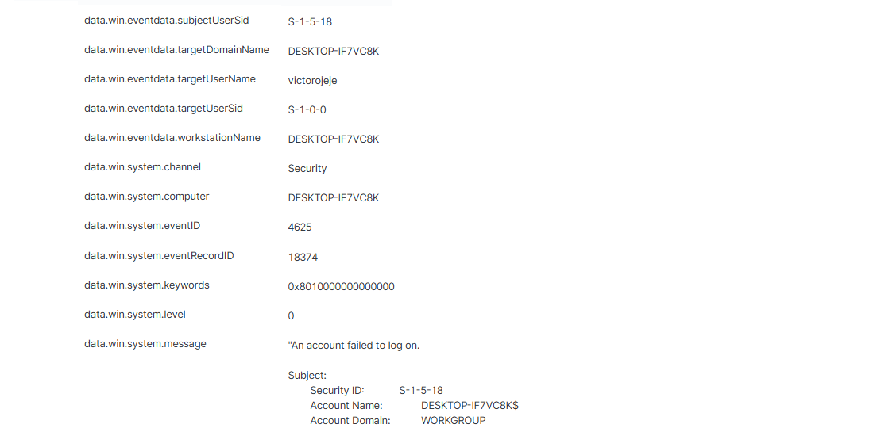
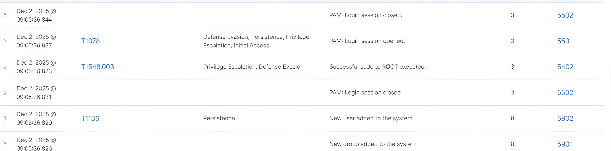
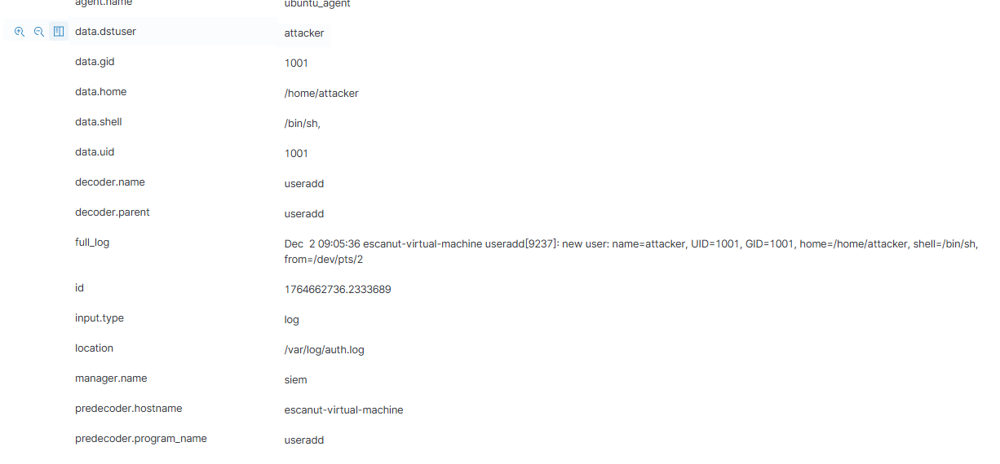
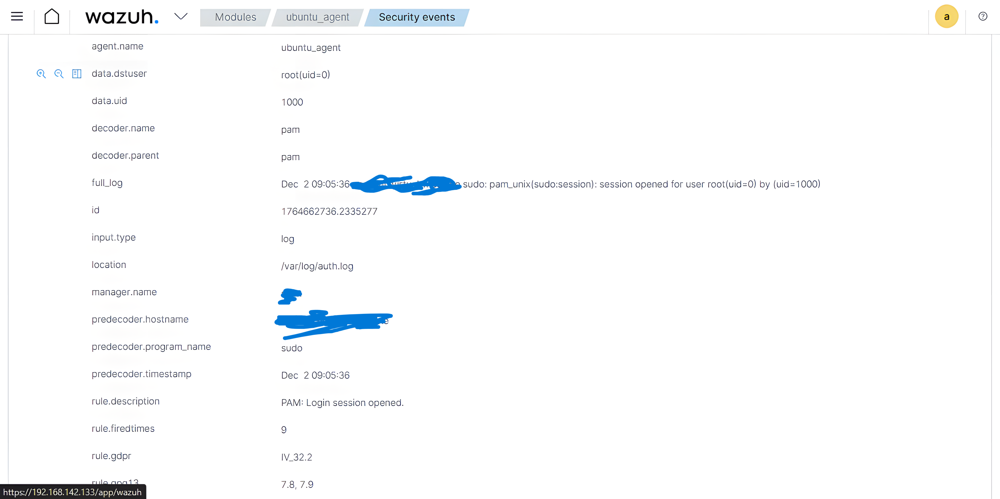

## Project Overview

Deployed and configured a centralized security monitoring solution using Wazuh SIEM for a client operating mixed Windows and Linux systems. The objective was to establish reliable endpoint visibility, validate log ingestion, and confirm detection of security-relevant activity across all managed hosts.

## Scope of Work

- Deployed and configured a Wazuh SIEM server
- Onboarded Windows and Linux endpoints
- Validated agent communication and log ingestion
- Generated and verified security-relevant events
- Delivered evidence of detections and system visibility

## Environment

**Deployed SIEM Server:** Wazuh Manager on Ubuntu Server

**Endpoints:**
- Windows 10 workstation
- Ubuntu Linux workstation

**Virtualization:** VMware Workstation

**Network:** Internal isolated network with all systems reachable by the SIEM

## Implementation Details

### SIEM Server Deployment

- Installed Wazuh using the official all-in-one installer
- Verified operational status of core services and dashboard access
- Confirmed the SIEM server was monitoring its own host activity

### Endpoint Onboarding

- Installed and registered the Wazuh agent on a Windows endpoint
- Installed and configured the Wazuh agent on a Linux endpoint
- Approved agents through the SIEM dashboard
- Verified active status and heartbeat for all endpoints

**Evidence: Active Agents**

### Detection Validation

Controlled security events were generated to validate end-to-end detection.

### Windows Event: Authentication Failure

Failed login attempts were generated on the Windows endpoint to validate credential monitoring. The activity was successfully ingested and surfaced as a security alert.

**Evidence: Windows Authentication Alert**

### Linux Event: Privilege Escalation

A controlled privilege escalation sequence was performed on the Linux endpoint, including user creation and elevation to administrative access. The SIEM captured the full activity chain.

**Evidence: Attack Path**

**Evidence: Linux User Added**

**Evidence: Initial Access**

**Evidence: Linux Privilege Escalation**

## Deliverables

- Fully deployed and operational Wazuh SIEM server
- Windows and Linux endpoints reporting to the SIEM
- Verified security alerts visible through the dashboard
- Screenshot evidence of:
  - Active agents
  - Detected security events
  - Alert timelines and details
- Structured repository containing screenshots and exported logs

## Outcome

The client received a centralized security monitoring deployment providing visibility into endpoint activity across multiple operating systems. The environment is suitable for ongoing detection, investigation, and future alert tuning without additional infrastructure changes.

## Contact Information

**Victor Ogechukwu Ojeje**

LinkedIn: https://www.linkedin.com/in/victorojeje/  
Email: ojejevictor@gmail.com  
GitHub: https://github.com/escanut

---